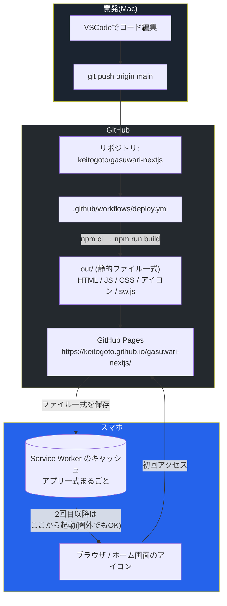

# ガスワリ！ 開発・運用リファレンス

このドキュメントは、「ガスワリ！」というドライブ費用の割り勘計算アプリが**どんな技術で・どういう仕組みで動いているか**、そして**今後どう機能追加・デバッグ・運用していくか**を一つにまとめたものです。この構築作業に関わっていない人が読んでも、環境の全体像がわかることを目指しています。

> 最終更新時点の構成: Next.js 16 の静的書き出し(`output: 'export'`)+ GitHub Pages + GitHub Actions + Service Worker によるオフライン対応。**サーバーは一切使っていない。**

---

## 1. このアプリは何か

スマホのブラウザから使う、ドライブでかかった費用(ガソリン代・高速代・その他費用)を乗車人数で割り勘計算するWebアプリ。やっていることは計算だけなので、サーバーで動く処理は存在せず、HTML/CSS/JavaScript の詰め合わせとして配信されるだけ。スマホの「ホーム画面に追加」でアプリのように使え、一度開けば圏外でも動く(PWA)。

---

## 2. なぜサーバーを無くしたのか(以前の構成との違い)

以前は Raspberry Pi 上の Docker で Next.js サーバーを常時起動し、Tailscale Funnel で外部公開していた。しかしこのアプリがサーバーを必要としていたのは**アクセスログの記録だけ**で、肝心の割り勘計算・レシートの画像化はすべてブラウザ内で完結していた。

そこでアクセスログ機能を廃止し、静的サイトとして書き出す構成に変更した。

| | 以前 | 現在 |
|---|---|---|
| 実行基盤 | Raspberry Pi 3 + Docker | なし(静的ファイルのみ) |
| 配信 | Tailscale Funnel | GitHub Pages |
| ビルド成果物 | Dockerイメージ(ghcr.io) | 静的ファイル一式(`out/`) |
| 自動更新 | Watchtower | GitHub Actions が直接デプロイ |
| アクセスログ | あり(`fs` でファイルに追記) | なし(記録する場所が無い) |
| 圏外での動作 | 不可 | 可(Service Worker) |
| 家の電気・Piの死活 | 依存する | 依存しない |

失ったのはアクセスログだけで、得たものは「Piが落ちていても使える」「電気代ゼロ」「オフラインで動く」。

---

## 3. システム全体像



**ポイント**

- 計算は最初から最後までブラウザの中だけで行われる。入力した金額や人数がどこかに送信されることはない
- 初回だけ GitHub Pages からファイルを取得し、以降は Service Worker のキャッシュから起動する
- 自宅のRaspberry Piはこのアプリには一切関与しない

---

## 4. 技術スタック一覧

| 分類 | 技術 | 役割 |
|---|---|---|
| フレームワーク | Next.js 16 (App Router) | 画面の描画・静的ファイルへの書き出し |
| UIライブラリ | React 19 | コンポーネントベースのUI |
| 画像化 | html2canvas | レシート画面をPNG画像化(共有機能) |
| 書き出し方式 | `output: 'export'` | サーバー不要の静的HTML/JS/CSSとして `out/` に出力 |
| PWA | `app/manifest.js` | スマホのホーム画面に追加できるようにする設定 |
| オフライン対応 | Service Worker (`scripts/sw-template.js`) | アプリ一式をキャッシュし、圏外でも起動できるようにする |
| 配信 | GitHub Pages | 静的ファイルのホスティング(無料・常時稼働) |
| CI/CD | GitHub Actions | pushをトリガーにビルドしてPagesへデプロイ |
| コード管理 | GitHub | ソースコードのバージョン管理 |
| フォント | Google Fonts (CDN) | Zen Kaku Gothic New / Noto Sans JP / JetBrains Mono |

> **フォントについて**: 書体だけは Google Fonts から読み込んでいる(日本語フォントは自前で持つとサイズが大きすぎるため)。ただし Service Worker が実際に使われたフォントファイルをキャッシュするので、一度表示した後はオフラインでも書体が崩れない。仮に読み込めなくても端末標準のゴシック体にフォールバックするだけで、計算機能には影響しない。

---

## 5. basePath(サブパス)の扱い

GitHub Pages のプロジェクトサイトは `https://<ユーザー名>.github.io/<リポジトリ名>/` というサブパスで配信される。ルート直下ではないので、`/_next/...` のような絶対パスのままだとファイルが見つからない。

そのため `next.config.js` で `basePath` を設定している。

```js
const basePath = process.env.NEXT_PUBLIC_BASE_PATH || '';
```

- **ローカル開発**: 環境変数なし → 空文字 → `http://localhost:3000/`
- **GitHub Actions**: `actions/configure-pages` が返す `base_path`(= `/gasuwari-nextjs`)を注入
- **独自ドメインを設定した場合**: `configure-pages` が空文字を返すので、コード側の変更は不要

`app/manifest.js` と `app/layout.js` のアイコン指定も同じ環境変数を参照している。`public/manifest.json` を静的ファイルとして置くと basePath を埋め込めないため、ビルド時に生成する `app/manifest.js` に移してある。

Service Worker(`sw.js`)だけは環境変数を埋め込めないので、自分自身が配信されているURLから basePath を逆算している。

```js
const BASE = self.location.pathname.replace(/\/sw\.js$/, '');
```

---

## 6. オフライン対応の仕組み

`npm run build` は2段階になっている。

```
next build                 → out/ に静的ファイルを書き出す
node scripts/build-sw.mjs  → out/ の中身を読んで out/sw.js を生成する
```

なぜ Service Worker を「生成」しているのか:

1. **ファイル名が毎回変わる**: Next.js の JS/CSS は `chunks/1p2wrp51tkswc.js` のようにハッシュ付きの名前になるため、キャッシュ対象を手書きで列挙できない
2. **遅延読み込みのファイルを取りこぼす**: `html2canvas`(約200KB)は「画像として保存」ボタンを押した瞬間に初めて読み込まれる。実際に読み込まれたものだけキャッシュする方式だと、ボタンを押す前に圏外になった場合にシェア機能が動かない
3. **ブラウザに更新を検知させる**: ブラウザは `sw.js` の中身が1バイトでも変わったときだけ新しい Service Worker をインストールする。ファイル一覧とビルドIDを毎回埋め込むことで、デプロイのたびに確実に更新される

生成された `sw.js` の動作:

| リクエストの種類 | 方針 |
|---|---|
| アプリを開く(ページ遷移) | まずネットワーク。失敗したらキャッシュしたHTMLを返す(=圏外でも起動する) |
| 同一オリジンのJS/CSS/アイコン | キャッシュ優先。ファイル名にハッシュが付いていて中身が変わらないため |
| Google Fonts | キャッシュを即返しつつ裏で取り直す(stale-while-revalidate) |

インストール時に `out/` の全ファイル(約1.4MB)を一括でキャッシュするので、**一度開いた後は完全にオフラインで動く**。古いビルドのキャッシュは `activate` 時に削除される。

---

## 7. デプロイの流れ

1. Macで `components/` 配下などを編集
2. `git add . && git commit -m "..." && git push origin main`
3. GitHub Actions(`.github/workflows/deploy.yml`)が自動起動
   - `npm ci` で依存関係をインストール
   - `actions/configure-pages` から basePath を取得
   - `npm run build` で `out/` を生成(Service Worker の生成まで含む)
   - `actions/upload-pages-artifact` → `actions/deploy-pages` でPagesへ公開
4. 1〜2分で `https://keitogoto.github.io/gasuwari-nextjs/` に反映される

**初回だけ必要な設定**: リポジトリの **Settings → Pages → Build and deployment → Source** を `GitHub Actions` にする。

**Private リポジトリの場合**: GitHub Pages で Private リポジトリを公開するには GitHub Pro が必要。Proを使わないならリポジトリを Public にする(このアプリはサーバー側の秘密情報を持たない)。

---

## 8. ディレクトリ構成とファイルの役割

```
gasuwari-nextjs/
├── app/
│   ├── layout.js       … 全ページ共通のレイアウト・メタ情報・Service Worker登録の差し込み
│   ├── page.js         … トップページ。GasuwariAppを置くだけ(サーバー処理なし)
│   ├── manifest.js     … PWA設定。basePathを含めるためビルド時に生成する
│   └── globals.css     … 全体のデザイントークン・スタイル定義
├── components/
│   ├── GasuwariApp.jsx        … 画面全体のロジック(状態管理・計算・シェア処理)。機能追加は主にここ
│   ├── SegmentedControl.jsx   … ガソリン種別選択などのタブ切り替え部品
│   ├── Stepper.jsx            … 人数の+/-ボタン部品
│   ├── ExtraCosts.jsx         … 追加費用の行を管理する部品
│   ├── Receipt.jsx            … シェア用レシート表示(画像化される部分)
│   └── ServiceWorkerRegister.jsx … sw.jsを登録するだけの部品(本番ビルド時のみ動作)
├── scripts/
│   ├── sw-template.js  … Service Workerの本体(プレースホルダ入りのテンプレート)
│   └── build-sw.mjs    … out/ を走査してファイル一覧を埋め込み、out/sw.js を書き出す
├── public/
│   ├── icons/          … ホーム画面用アイコン(apple-icon-180.png / icon-192.png / icon-512.png)
│   └── .nojekyll       … GitHub Pages側で `_next` ディレクトリが無視されないようにする保険
├── .github/workflows/deploy.yml … GitHub Actions(ビルド → GitHub Pagesへデプロイ)
└── next.config.js      … output: 'export' と basePath の設定
```

---

## 9. 開発・デバッグ手順

```bash
npm install
npm run dev       # http://localhost:3000
```

本番と同じ静的ファイルを確認したいとき:

```bash
npm run build     # out/ を生成
npm run preview   # out/ をローカルサーバーで配信
```

**Service Worker のデバッグ**

- `npm run dev` では Service Worker を登録しない(ホットリロードと衝突するため)。オフライン動作を確認したいときは必ず `npm run build && npm run preview` を使う
- Chrome DevTools の **Application → Service Workers / Cache Storage** で登録状況とキャッシュ内容を確認できる
- 挙動がおかしいときは Application → Storage → **Clear site data** で全部消してから再読み込みする
- オフライン動作の確認は DevTools の Network タブで **Offline** にチェックを入れるか、`npm run preview` を止めてから再読み込みする

**VSCodeでのデバッグ**

`.vscode/launch.json` の **Next.js: debug client-side** を使うのが基本。計算ロジックもボタン処理もすべてブラウザ側で動くため、サーバーサイドのデバッグ構成を使う場面はもう無い。

---

## 10. トラブルシューティング

| 症状 | 主な原因 | 対処 |
|---|---|---|
| GitHub Actionsが赤い❌で失敗 | ビルドエラー(コードの構文ミスなど) | Actionsタブでログの赤字部分を確認。ローカルで`npm run build`が通るか先に確認する |
| デプロイのステップで権限エラー | Pages の Source が `GitHub Actions` になっていない | Settings → Pages → Build and deployment → Source を `GitHub Actions` に変更 |
| Private リポジトリでPagesが有効化できない | Private リポジトリのPages公開はGitHub Pro限定 | リポジトリをPublicにするか、Proにする |
| 画面が真っ白/JSが404になる | basePath が合っていない | Actionsのログで `NEXT_PUBLIC_BASE_PATH` の値を確認。独自ドメイン設定の有無で変わる |
| コードを直したのにスマホで変わらない | 古いService Workerがキャッシュを返している | ページを再読み込み(通常はこれで新SWが入る)。それでもだめならブラウザのサイトデータを消す |
| 「画像として保存」が動かない | html2canvasのチャンクが読めていない | DevTools の Cache Storage にチャンクが入っているか確認。`npm run build` で `sw.js を生成しました` のログが出ているかも確認 |
| アイコンを差し替えたのにスマホで変わらない | iOS Safari側のアイコンキャッシュ | 設定→Safari→履歴とWebサイトデータを消去 → ホーム画面のアイコンを削除して追加し直す |
| オフラインで開けない | 一度もオンラインで開いていない/SW未登録 | 一度オンラインで開く必要がある。`npm run dev` ではSWは登録されない |

---

## 11. 用語集(この分野に馴染みがない人向け)

- **静的サイト(static site)**: あらかじめ完成したHTML/CSS/JavaScriptのファイルを置いておくだけのWebサイト。アクセスのたびにサーバーで処理を実行する動的サイトと違い、動かすためのサーバーが要らない
- **`output: 'export'`**: Next.jsのビルド設定。アプリを静的ファイル一式(`out/`)として書き出すモード
- **basePath**: サイトがドメインの直下ではなくサブパス(`/gasuwari-nextjs/`)で配信されるときに、全てのリンクやファイルパスの先頭に付ける文字列
- **Service Worker**: ブラウザがページとは別に裏で動かす小さなプログラム。通信を横取りして、キャッシュから返したり、オフライン時の動作を制御したりできる
- **キャッシュ優先 / stale-while-revalidate**: Service Workerの代表的な方針。前者は「キャッシュがあればネットワークを見ない」、後者は「キャッシュを即返しつつ裏で新しいものを取り直す」
- **PWA (Progressive Web App)**: 普通のWebサイトを、スマホのホーム画面にアイコンとして追加してアプリのように使えるようにする仕組み
- **GitHub Pages**: GitHubが提供する静的サイトのホスティングサービス。リポジトリの内容をそのままWebサイトとして公開できる
- **GitHub Actions**: GitHub上で動く自動化の仕組み。今回は「pushしたら自動でビルドしてPagesへ公開」を担当している
- **CI/CD**: コードを変更したら自動でテスト・ビルド・配布・反映まで行う仕組み全般の呼び方

---

## 12. 今後の拡張の進め方(参考)

1. `components/GasuwariApp.jsx` など該当ファイルを編集
2. `npm run dev` でローカル確認
3. `npm run build && npm run preview` で本番と同じ静的ファイル + オフライン動作を確認
4. `git add . && git commit -m "機能: ○○を追加" && git push origin main`
5. GitHub Actionsが緑✅になるのを確認
6. スマホで動作確認(反映されない場合は一度再読み込みしてService Workerを更新する)

**サーバーが必要になる機能を足したくなったら**: アクセス解析や履歴のクラウド保存など、どうしてもサーバーが要る機能を入れる場合は、この静的サイト構成のまま外部サービス(アクセス解析SaaSなど)を足すか、APIだけを別に用意するのが素直。アプリ本体をサーバー実行に戻す必要はない。
