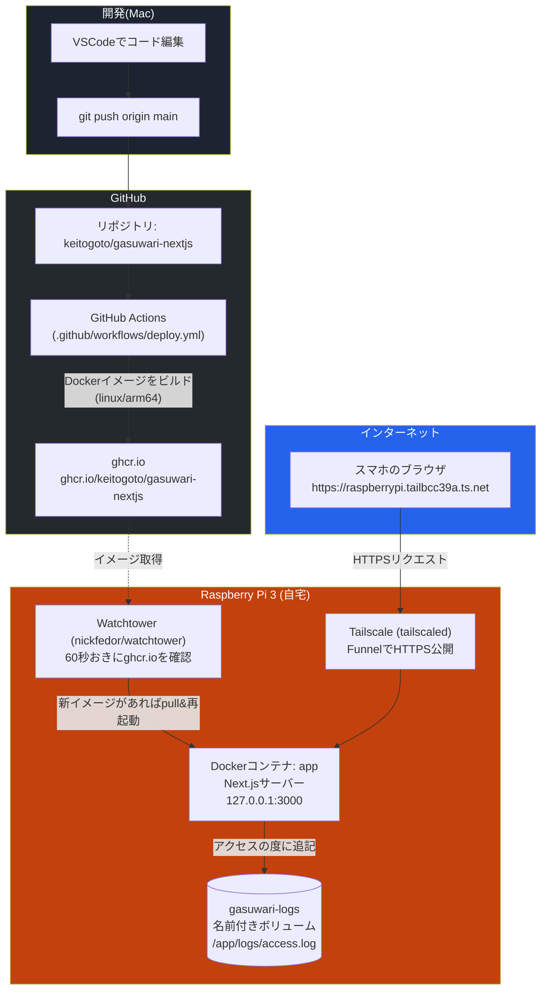

# ガスワリ！ 開発・運用リファレンス

このドキュメントは、「ガスワリ！」というドライブ費用の割り勘計算アプリが**どんな技術で・どういう仕組みで動いているか**、そして**今後どう機能追加・デバッグ・運用していくか**を一つにまとめたものです。この構築作業に関わっていない人が読んでも、環境の全体像がわかることを目指しています。

> 最終更新時点の構成: Next.js 16 + Docker + Tailscale Funnel(Raspberry Pi 3上で稼働)+ GitHub Actions/ghcr.io + Watchtower(nickfedor版フォーク)+ アクセスログ機能

---

## 1. このアプリは何か

スマホのブラウザから使う、ドライブでかかった費用(ガソリン代・高速代・その他費用)を乗車人数で割り勘計算するWebアプリ。個人のRaspberry Piでホストされており、インターネット上のどこからでもURLでアクセスできる(スマホの「ホーム画面に追加」でアプリのように使える = PWA)。

---

## 2. システム全体像

大きく分けて2つの流れがある。

1. **開発・デプロイの流れ**: 開発者(Mac)がコードを直すと、自動的に本番(ラズパイ)に反映される
2. **実行時のアクセスの流れ**: スマホからアクセスすると、そのリクエストがラズパイのアプリまで届き、アクセスログが記録される



**ポイント**

- Piはルーターのポート開放を一切していない。Tailscale FunnelがPiから外向きに接続を確立し、そこにインターネットからのリクエストが中継される仕組み(Piのグローバル待受ポートは無い)
- 開発者が`git push`する以外、人の手を介さずに本番へ反映される(Watchtowerが自動検知)
- アプリはアクセスされるたびに日時とUser-Agentを`gasuwari-logs`という名前付きボリュームに記録する(コンテナが作り直されても消えない)
- **Tailscale Funnelの仕様上、アクセスしてきた人の実IPアドレスはアプリ側にはわからない**(日時とUser-Agentのみ記録可能)

---

## 3. 技術スタック一覧

| 分類 | 技術 | 役割 |
|---|---|---|
| フレームワーク | Next.js 16 (App Router) | 画面の描画・ビルド |
| UIライブラリ | React 19 | コンポーネントベースのUI |
| 画像化 | html2canvas | レシート画面をPNG画像化(共有機能) |
| PWA | `manifest.json` | スマホのホーム画面に追加できるようにする設定 |
| アクセスログ | Node.js `fs` (Server Component内) | アクセス日時・User-Agentをファイルに記録 |
| コンテナ化 | Docker (マルチステージビルド) | アプリを実行環境ごとパッケージ化 |
| 実行基盤 | Raspberry Pi 3 (Raspberry Pi OS Lite 64-bit) | 自宅で常時稼働させるサーバー本体 |
| 自動更新 | Watchtower (`nickfedor/watchtower`) | 新しいDockerイメージを検知して自動的に再起動 |
| 外部公開 | Tailscale Funnel | ポート開放・固定IP不要でHTTPS公開 |
| コード管理 | GitHub (Private リポジトリ) | ソースコードのバージョン管理 |
| イメージ保管 | GitHub Container Registry (ghcr.io、Public) | ビルド済みDockerイメージの保管場所 |
| CI/CD | GitHub Actions | pushをトリガーにDockerイメージを自動ビルド・push |

> **補足: Watchtowerのイメージについて** 最初は本家`containrrr/watchtower`を使っていたが、開発が2年以上止まっており、新しいDocker(v29以降、API v1.40+要求)と非互換になり`client version 1.25 is too old`というエラーでクラッシュループした。有志がメンテナンスを引き継いでいる`nickfedor/watchtower`(設定はそのまま使える drop-in replacement)に切り替えて解決した。

---

## 4. リクエストの流れ(実行時)

スマホで `https://raspberrypi.tailbcc39a.ts.net` を開いたときに起きていること:

1. スマホがそのURLにHTTPSでアクセス
2. Tailscaleの中継サーバー(Funnel relay)がリクエストを受け取り、Pi上で動いている`tailscaled`まで暗号化された経路で転送
3. Pi上の`tailscaled`が、あらかじめ設定された転送ルール(`tailscale funnel --bg 3000`)に従って `http://127.0.0.1:3000` に転送
4. Docker上の`app`コンテナ(Next.jsサーバー)がリクエストを受け取り、`app/page.js`が実行される
5. `page.js`はリクエストのUser-Agentを取得し、`/app/logs/access.log`(`gasuwari-logs`ボリューム)に1行追記する
6. 画面のHTML/JS/CSSを返す。以降のボタン操作や計算はすべてブラウザ内(クライアントサイド)で完結する

> ※ サーバー側にデータベースはなく、記録しているのは「いつ・どんなブラウザ/端末からアクセスがあったか」のログのみ。計算結果や入力内容はサーバーに送信されない。

---

## 5. デプロイの流れ(コードを直してから本番に反映されるまで)

1. Macで `components/` 配下などを編集
2. `git add . && git commit -m "..." && git push origin main`
3. GitHub Actions(`.github/workflows/deploy.yml`)が自動起動
   - リポジトリを取得
   - QEMUでarm64(ラズパイのCPUアーキテクチャ)エミュレーション環境を用意
   - `Dockerfile`に従ってNext.jsアプリをビルド
   - 完成したイメージを `ghcr.io/keitogoto/gasuwari-nextjs:latest` としてpush
4. ラズパイ上のWatchtowerコンテナが最大60秒おきに`ghcr.io`をチェック
5. 新しいイメージを検知したら、自動的に`docker pull`→`app`コンテナを再作成・再起動
6. 数分以内に本番URLに新しいコードが反映される

**今すぐ反映させたい場合(Watchtowerを待たない)**

```bash
cd ~
docker compose pull
docker compose up -d
```

**それでも反映されない・古いイメージのまま動いているように見える場合**

```bash
docker compose down
docker compose pull
docker compose up -d --force-recreate
docker inspect gasuwari-app --format '{{.Created}}'
```

最後のコマンドで表示される日時が直近になっていれば、コンテナは正しく作り直されている。

---

## 6. ディレクトリ構成とファイルの役割

```
gasuwari-nextjs/
├── app/
│   ├── layout.js       … 全ページ共通のレイアウト・メタ情報・PWA設定の読み込み
│   ├── page.js         … トップページ。アクセスログの記録もここで行う
│   └── globals.css     … 全体のデザイントークン・スタイル定義
├── components/
│   ├── GasuwariApp.jsx     … 画面全体のロジック(状態管理・計算・シェア処理)。機能追加は主にここ
│   ├── SegmentedControl.jsx… ガソリン種別選択などのタブ切り替え部品
│   ├── Stepper.jsx         … 人数の+/-ボタン部品
│   ├── ExtraCosts.jsx      … 追加費用の行を管理する部品
│   └── Receipt.jsx         … シェア用レシート表示(画像化される部分)
├── public/
│   ├── manifest.json   … PWA設定(アプリ名・アイコン・テーマカラー)
│   └── icons/          … ホーム画面用アイコン(apple-icon-180.png / icon-192.png / icon-512.png)
├── Dockerfile          … 本番用Dockerイメージのビルド手順(3段階: 依存関係→ビルド→実行専用の軽量イメージ)
├── docker-compose.yml  … ラズパイ上で実際に起動する構成(app + watchtower、ログ用ボリューム含む)
├── .github/workflows/deploy.yml … GitHub Actionsの自動ビルド設定
└── next.config.js      … Next.jsの設定(output: 'standalone' でDocker用に最適化)
```

---

## 7. アクセスログを確認する手順

Piに保存されているアクセスログ(日時・User-Agent)は、SSH接続して確認する。

```bash
ssh keito@raspberrypi.local

# 全履歴を一度に見る
docker compose exec app cat /app/logs/access.log

# リアルタイムで見る(新しいアクセスがあるとその場で表示される)
docker compose exec app tail -f /app/logs/access.log
```

**出力例**

```
2026-07-08T21:40:20.637Z    Mozilla/5.0 (Macintosh; Intel Mac OS X 10_15_7) AppleWebKit/537.36 (KHTML, like Gecko) Chrome/148.0.0.0 Safari/537.36
2026-07-08T21:45:02.112Z    Mozilla/5.0 (iPhone; CPU iPhone OS 18_0 like Mac OS X) AppleWebKit/605.1.15 (KHTML, like Gecko) Version/18.0 Mobile/15E148 Safari/604.1
```

**注意点**

- Tailscale Funnelの仕様上、**アクセス元の実IPアドレスは記録されない**(誰が/どこからアクセスしたかまでは特定できない)
- ログは`gasuwari-logs`という名前付きDockerボリュームに保存されるため、`docker compose down`→`up`やWatchtowerによる自動更新でコンテナが作り直されても消えない
- ボリューム自体を削除する(`docker volume rm gasuwari-logs`など)と当然ログも消えるので、明示的に消さない限り残り続ける

---

## 8. VSCodeでのデバッグ手順

プロジェクトのルート(`gasuwari-nextjs/`)に `.vscode/launch.json` を作成すると、VSCode上でブレークポイントを使ったデバッグができる。以下はNext.js公式ドキュメントに基づく設定。

```json
{
  "version": "0.2.0",
  "configurations": [
    {
      "name": "Next.js: debug server-side",
      "type": "node-terminal",
      "request": "launch",
      "command": "npm run dev -- --inspect"
    },
    {
      "name": "Next.js: debug client-side",
      "type": "chrome",
      "request": "launch",
      "url": "http://localhost:3000"
    },
    {
      "name": "Next.js: debug full stack",
      "type": "node",
      "request": "launch",
      "program": "${workspaceFolder}/node_modules/next/dist/bin/next",
      "runtimeArgs": ["--inspect"],
      "skipFiles": ["<node_internals>/**"],
      "serverReadyAction": {
        "action": "debugWithChrome",
        "killOnServerStop": true,
        "pattern": "- Local:.+(https?://.+)",
        "uriFormat": "%s",
        "webRoot": "${workspaceFolder}"
      }
    }
  ]
}
```

**使い方**

1. VSCode左側の「実行とデバッグ」パネル(`⇧+⌘+D`)を開く
2. 上部のドロップダウンで用途に応じた設定を選ぶ
   - **debug server-side**: `app/page.js`のアクセスログ処理など、サーバーで動くコードにブレークポイントを置きたいとき
   - **debug client-side**: ボタンのクリック処理や計算ロジックなど、ブラウザで動く部分を止めたいとき。一番よく使うことになるはず
   - **debug full stack**: 両方同時に見たいとき
3. `F5`でデバッグ開始。ブレークポイントは行番号の左をクリックして設置

**Dockerコンテナ内のログを見たいとき(本番の挙動確認)**

```bash
docker compose logs -f app        # リアルタイムでアプリのログを流し見る(console.errorなど)
docker exec -it gasuwari-app sh   # コンテナの中に入って直接調査する
```

---

## 9. ラズパイ運用コマンド チートシート

```bash
# Macから接続
ssh keito@raspberrypi.local

# アプリの状態確認
docker compose ps
docker compose logs -f app

# 手動で最新版に更新
docker compose pull && docker compose up -d

# 反映されない場合は作り直す
docker compose down
docker compose pull
docker compose up -d --force-recreate

# アクセスログを見る
docker compose exec app cat /app/logs/access.log
docker compose exec app tail -f /app/logs/access.log

# Tailscale Funnelの状態確認
sudo tailscale funnel status

# Funnelを一時的に止める / 再開する
sudo tailscale funnel 3000 off
sudo tailscale funnel --bg 3000

# Piの再起動
sudo reboot
```

**Pi再起動後の注意**: Docker (`restart: unless-stopped`)とtailscaled(systemdサービス)はどちらも自動起動するが、`tailscale funnel`の設定はPiの再起動では原則保持される(tailscaledが設定を保存している)。再起動後は念のため`sudo tailscale funnel status`で確認するとよい。

---

## 10. トラブルシューティング

| 症状 | 主な原因 | 対処 |
|---|---|---|
| GitHub Actionsが赤い❌で失敗 | ビルドエラー(コードの構文ミスなど) | Actionsタブでログの赤字部分を確認。ローカルで`npm run build`が通るか先に確認する |
| Watchtowerが`Restarting`を繰り返す/`client version 1.25 is too old`エラー | 本家`containrrr/watchtower`が新しいDocker(v29+)と非互換 | `docker-compose.yml`の`watchtower`イメージを`nickfedor/watchtower`に変更 |
| Watchtowerが新しいイメージを取ってこない | `ghcr.io`のパッケージが非公開のまま / ラベル未設定 | パッケージがPublicか確認。`app`サービスに`watchtower.enable=true`ラベルがあるか確認 |
| `docker compose pull`しても`docker inspect`の作成日時が変わらない | 古いコンテナ・ネットワークが残っている | `docker compose down` → `docker compose pull` → `docker compose up -d --force-recreate` |
| アイコンなど静的ファイルを差し替えたのにスマホで変わらない | iOS Safari側のアイコンキャッシュ | 設定→Safari→履歴とWebサイトデータを消去 → ホーム画面のアイコンを削除して追加し直す |
| アクセスログのファイルが無い(`No such file or directory`) | まだ一度もアクセスがない/コンテナが新しい設定で再作成されていない | 一度スマホでURLを開いてから確認。反映されていなければ上記の`--force-recreate`を実施 |
| スマホからURLにアクセスできない | Piの電源が落ちている / Wi-Fiが切れている / Funnelがoffになっている | `ssh`で接続できるか確認 → `sudo tailscale funnel status`を確認 |
| `docker compose up`でport already in useエラー | 別のプロセスが3000番ポートを使っている | `sudo lsof -i :3000` で確認し、不要なプロセスを止める |
| ローカルの`npm run dev`は動くのに本番だけ壊れる | 環境差異(Node.jsバージョン違いなど) | `Dockerfile`の`node:20-alpine`とローカルのNode.jsバージョンを揃える |

---

## 11. 用語集(この分野に馴染みがない人向け)

- **Docker / コンテナ**: アプリと、それが動くのに必要なもの(Node.jsなど)を一つの箱(コンテナ)にまとめる技術。「自分のPCでは動くのに本番では動かない」問題を減らせる
- **Dockerイメージ**: コンテナの元になる、実行前のパッケージされたファイル一式
- **Dockerボリューム**: コンテナが作り直されても残しておきたいデータ(今回はアクセスログ)を保存しておく場所
- **GHCR (GitHub Container Registry)**: DockerイメージをGitHub上に保管しておく場所。`ghcr.io/ユーザー名/イメージ名`という住所で管理される
- **CI/CD**: コードを変更したら自動でテスト・ビルド・配布・反映まで行う仕組み全般の呼び方。今回は「pushしたら自動でビルド→自動で本番反映」の部分がこれにあたる
- **Watchtower**: 動いているDockerコンテナを監視し、新しいイメージが公開されたら自動で入れ替えてくれる補助ツール
- **Tailscale**: 複数の端末同士を安全に直接つなぐ仮想ネットワーク(VPN)サービス。今回はその中の「Funnel」機能で、ラズパイの中の1つのサービスだけをインターネットに公開している
- **PWA (Progressive Web App)**: 普通のWebサイトを、スマホのホーム画面にアイコンとして追加してアプリのように使えるようにする仕組み
- **standalone出力**: Next.jsのビルド時に、Docker配布に必要な最小限のファイルだけを`.next/standalone`にまとめてくれる機能

---

## 12. 今後の拡張の進め方(参考)

新しい機能を追加したくなったら、次の順で進めるとスムーズ。

1. `components/GasuwariApp.jsx`など該当ファイルを編集(必要ならVSCodeのデバッガでロジックを確認)
2. `npm run dev`でローカル確認
3. `npm run build`でビルドが通ることを確認(本番と同じ条件でのチェック)
4. `git add . && git commit -m "機能: ○○を追加" && git push origin main`
5. GitHub Actionsが緑✅になるのを確認
6. 数分待つか、Piで手動`docker compose pull && up -d`(反映されなければ`--force-recreate`)
7. スマホで動作確認
